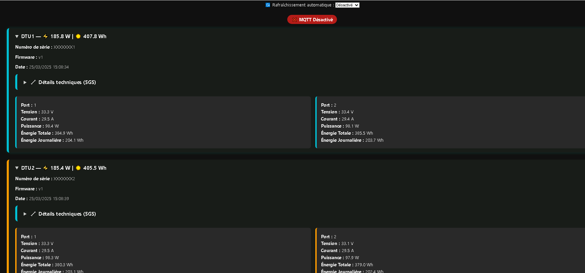

# hoymiles_hms_wifi_mqtt
Un petit serveur Node qui affiche les données live des micros onduleurs de la serie HMS-XXXXW-2T Wifi Hoymiles et permet une injection MQTT pour une exploitation avec des outils de monitoring .

Il utilise la librairie python (https://github.com/suaveolent/hoymiles-wifi) pour récupérer les données via protobuf


Prérequi : vous devez avoir vos micros onduleurs connectés sur votre reseau local en Wifi et connaitre les IP exacte de chacun. l'idéal serait de leur donner une ip fixe dans votre serveur DHCP

**Information : Ce projet n'est pas affilié à Hoymiles et reste un projet amateur pour partager des outils qui a l'heure actuel n'existe pas sur le marché.**

##
A small Node server that displays live datas from the HMS-XXXXW-2T Wifi Hoymiles series microinverters and allows MQTT injection for use with monitoring tools.

It uses the python library (https://github.com/suaveolent/hoymiles-wifi) to retrieve datas via protobuf.


Prerequisite: you must have your microinverters connected to your local Wifi network and know the exact IP of each one. Ideally, you should give them a fixed IP in your DHCP server.

**Information: This project is not affiliated with Hoymiles and remains an amateur project to share tools that currently don't exist on the market.**


## Supported Devices

The library was successfully tested with:
- Hoymiles HMS-1000W-2T

The library should work with:
- Hoymiles HMS-400W-1T
- Hoymiles HMS-800W-2T
- Hoymiles HMS-2000DW-4T
- Hoymiles DTU-WLite
- Hoymiles DTU-Pro (S)
- Hoymiles HYS-4.6LV-EUG1
- Hoymiles HYT-5.0HV-EUG1
- Solenso H-1000 (not tested for command, only to get data)
- Solenso DTU_SLS (not tested for command, only to get data)


## configure and build docker
edit the file app/config.js
and replace with your values
```js
	"hosts":[
		// HMS WiFi IP address list
		{"name":"DTU1", "url":"192.168.1.XXX"}, // replace with your HMS IP address
		{"name":"DTU2", "url":"192.168.1.XXX"},
		{"name":"DTU3", "url":"192.168.1.XXX"}
	],
	"mqtt":{
		"enable": true, // enable/disable mqtt injection
		"host": "mqtt://192.168.1.XXX", // replace with your MQTT host
		"username": "XXX", // MQTT username
		"password": "XXX", // MQTT password
		"topic": "hms" // MQTT topic
	},
	"cron" : '* 6-22 * * *' // MQTT injection frequency,  6 to 20  every minute

```


```bash
docker build -t hoymiles_hms_wifi_mqtt .

``` 

### Direct docker usage
```bash
docker run -p 3157:3157 hoymiles_hms_wifi_mqtt
``` 

### docker-compose usage
```Dockerfile
version: "3.3"
services:
  hms_wifi_mqtt:
    image: "hms_wifi_mqtt"
    restart: always
    ports:
      - "3157:3157"
``` 
```bash
docker-compose up -d hms_wifi_mqtt
```


### visualisation
open your server URL on port 3157 (ex http://127.0.0.1:3157)
####



## inspired by
* ([suaveolent](https://github.com/suaveolent)) [hoymiles-wifi](https://github.com/suaveolent/hoymiles-wifi)
